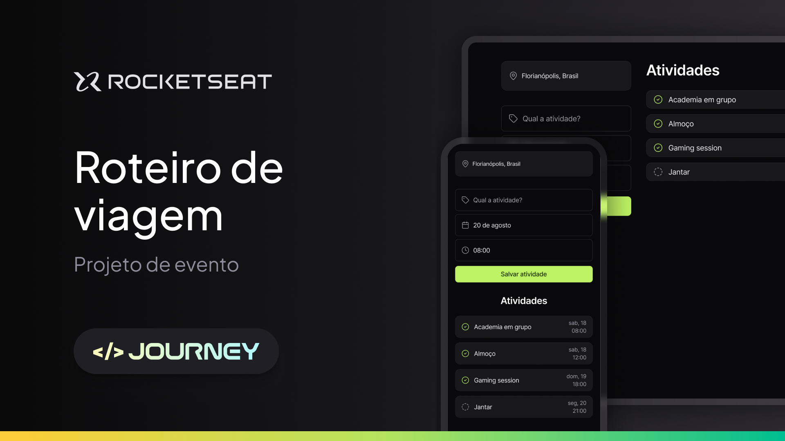

## 📖 Sobre

Projeto realizado dentro do evento NLW Journey na plataforma da Rocketseat para iniciar nos conceitos de HTML, CSS e JS.

  
    

 

## 💻 Tecnologias

Esse projeto foi desenvolvido com as seguintes tecnologias:

- HTML
- CSS
- Javascript
- Figma

 

## 🎨 Protótipo

O protótipo deste projeto foi criado no Figma e desenvolvido pela [Rocketseat](https://www.rocketseat.com.br) 💜.

 

## 🚀 Visualizar o Projeto

O projeto pode ser visualizado [aqui](https://nicolevlc.github.io/projeto-planejador-de-viagens/).

 

## 📝 Licença
Esse projeto está sob a licença MIT. Veja o arquivo **LICENSE** para mais detalhes.